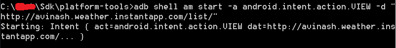

# InstantAppDemo

Google recently released Instant Apps to developers as part of an effort to help kickoff the next big enhancement to the native app experience in Android. Instant Apps aim to help bring users into the best native app experience as quickly as possible by downloading only parts of an application when they need them. This makes it fast and easy to engage users with great mobile app experiences, even though they do not have the application installed on their devices.

Instant Apps are delivered to the user in small feature modules, each containing only the code and resources needed to accomplish a specific action. Instant Apps are triggered by URL intents, meaning that they can be started from anywhere including, search results, social media shares, messages, beacons, NFC and other applications or even other Instant Apps.

Instant Apps share a single code base with the installed apk counterparts and are also distributed via the Google Play Store through the Android Instant Apps section.

This sample application is used to demonstrate the development and installation of instant app on device.

## Prerequisites

### Install instant app sdk from SDK manager
  

## Building an Instant app

### Creating a feature modules:
* Feature modules are modules that applies the new 'com.android.feature' Gradle plugin. They are simply library projects, producing an aar when consumed by other modules.
* It’s worth noting that they do not have application IDs because they are just library projects.
* The feature module’s manifest is also worth noting because since it is functionally only a part of the full app, its manifest will be merged with others when the project is assembled.
* build.gradle for feature module will look like :

  

### Creating a base module: 
* Every project that uses feature modules must have exactly one base module and every feature module must depend on the base module.
* The base feature module can be thought of as the root of your project. It contains the shared code and resources to be used by other modules.
* Feature module with the property 'baseFeature' set to 'true'.
* build.gradle for base feature module will look like :

  

### Creating an installable(i.e. APK) module:
* This is the normal build module that we are all familiar with. Now it’s setup to consume the base and feature modules in order to produce an output apk which needs to be installed on user devices.
* Since it aims to produce an output which is an installable artifact this module does have an application ID.
* We need to add 'com.android.application' plugin for installable module.
* The application manifest here is the result of merging all of the other manifests that it inherits from the other feature modules. As a result its manifest is pretty sparse.
* build.gradle for base feature module will look like :

  

### Creating an instant module:
* Instant App module - implements the com.android.instant plugin. 
* It consumes feature modules and produce a split APK zip containing all of the features that will go into the Instant App.
* It’s pretty much an empty shell of a project without a manifest that only implements other features feature modules in the project.
* build.gradle for base feature module will look like :

  

## Installation of instant app:

### Creating the instant app build process:
* Users don't install your app when using Google Play Instant, so to open your app, users will usually click on a link. For Google Play Instant, URLs are the entry point into an app and they are associated with Activities. These URLs must be verified App Links.
* To create App Links, you'll use a feature built into Android Studio called "App Links Assistant." Open this tool by going to Tools -> Apps Links Assistant :

  

* From the sidebar, tap on the "Open URL Mapping Editor" button (which appears near the top): 

  

* From the editor, tap the "+" button to add a new app link entry:

  Create a new URL mapping with the following details:

  Host: http://avinash.weather.instantapp.com

  Select "pathPrefix" from dropdown

  Path: /list/

  Activity: com.avinash.instant.feature.list.weather.presentation.activity.WeatherListActivity
  
* Similarly add the remaining activities and finally the url map will look like as shown below:

  

### Setup your Run Configuration:

* To run your creation, you'll need to setup a run configuration that says which URL to open. Click the Run configuration dropdown and choose "Edit Configurations..."

  

* Select instant under Android App. Replace the text ‘<< ERROR - NO URL SET>>' with http://avinash.weather.instantapp.com/list/ as shown below:

  

### Run your instant app:

#### Running instant app from Android studio:

* Make sure you uninstall the "InstatntAppDemo" app which was installed with a regular APK before proceeding further. If the regular APK is installed, the instant app will not be started as the device already has the full apk app.
* To run your instant app, select "instantapp_weather" from the Run configuration dropdown and click Run.
* Your instant app will be installed on your device.

#### Running instant app from command prompt:

* If you switch to Project mode, you should see the following generated files in InstatntAppDemo/instantapp_weather/build/outputs/apk/debug/instantapp_weather-debug.zip as shown below:

  

* You can also install the instant app with command prompt using 'adb multiple-install -r -t -- basefeature.apk requiredfeature.apk' command as shown below:

  

* Once installed successfully you can run the instant app with command prompt using 'adb shell am start -a android.intent.action.VIEW -d "feature_url"' command as shown below:

  

* To verify the running app is, in fact, an instant app, go to the Recents screen and check. You should see "InstantAppDemo" with the lightning bolt icon.

  

## Uploading the Instant App to the Google Play Store

* To upload an instant app in google play store you can follow the link mentioned below:
https://support.google.com/googleplay/android-developer/answer/7381861?hl=en

## Limitations :
  
### You still need to comply with the Google's conditions for Instant Apps. Notably:

* Instant Apps can only use certain permissions.
* Instant Apps can only have a maximum size of 4 MB (counting the sum of the base apk file and the largest feature apk file). Under Google Play Instant 10MB Program, user will be able to upload instant apps with 10MB size.
* You also need to upload an installed, non-instant app.
* Each uploaded version of an app needs to have a higher version number than the previous version.

